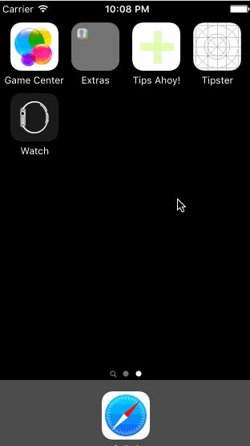

# Tips-Ahoy

Submitted by: Lauren Tindal

Time spent: 8 hours spent in total

## User Stories

The following **required** functionality is complete:
* [X] User can enter a bill amount, choose a tip percentage, and see the tip and total values.

The following **optional** features are implemented:
* [X] Custom font
* [X] UI animations
* [ ] Making sure the keyboard is always visible and the bill amount is always the first responder. This way the user doesn't have to tap anywhere to use this app. Just launch the app and start typing. [This didn’t quite fit into my use case]

The following **additional** features are implemented:

- [X] The user can open up the Paypal, Venmo and Square Cash URLs on Safari straight from the app. Ideally this would have a deep link into the app on the user’s phone, but I’m hoping that the web login will prompt the app opening on the user’s phone if the app is downloaded. Venmo has a feature in which you can divide any sum in the app, so as long as the user has the total amount, all they should need is the prompt to their payment source. I implemented this flow to solve an issue I have often, which is forgetting to pay/request money electronically when I split a bill. I hoped that by totaling the bill, then moving directly to payment, others could avoid this problem!
- [X] Rounded buttons, a colored nav bar, the ability to clear a bill entry

## Video Walkthrough 

Here's a walkthrough of implemented user stories:

GIF created with [LiceCap](http://www.cockos.com/licecap/).

## Notes

Describe any challenges encountered while building the app.

- I built an initial version of the app and messed up the interaction between the initial bill field and the tip calculation; I’m still not sure what happened, so I had to re-build the app. De-bugging in Swift isn’t something I’m quite adept at yet.
- I change the name of my app so I had to re-enter a new one in the p.list!
- I accidentally messed up the syncing of my local repository with my remote one, so had some trouble with Github sadly...

## License

    Copyright [yyyy] [name of copyright owner]

    Licensed under the Apache License, Version 2.0 (the "License");
    you may not use this file except in compliance with the License.
    You may obtain a copy of the License at

        http://www.apache.org/licenses/LICENSE-2.0

    Unless required by applicable law or agreed to in writing, software
    distributed under the License is distributed on an "AS IS" BASIS,
    WITHOUT WARRANTIES OR CONDITIONS OF ANY KIND, either express or implied.
    See the License for the specific language governing permissions and
    limitations under the License.
